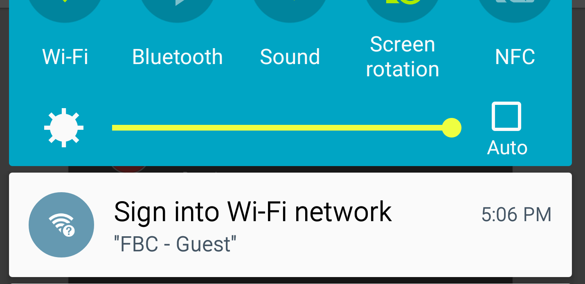
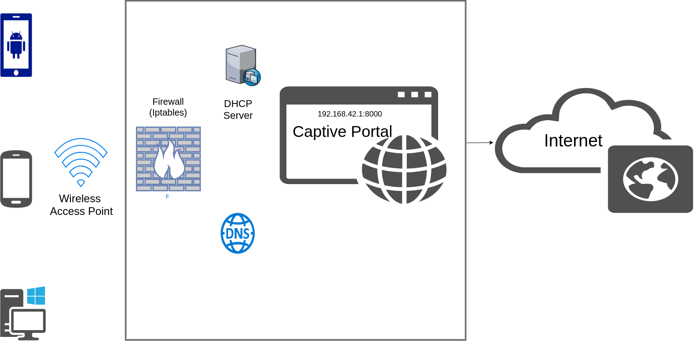

# Captive Portal

Tutorial on how to build a captive portal (Raspberry Pi/Linux/Ubuntu/Raspian/Debian)

<b>What's a captive portal?</b>
>It's that thing which pops up and asks you to login when you try to connect to internet via public WiFi spots (airport
/cafe/railway-station).



<i>So, how to build it?</i>

If you read the Wikipedia <a href="https://en.wikipedia.org/wiki/Captive_portal" target="_blank">article</a> about captive portal, there are 3 ways to implement a captive portal:

1. <b>HTTP redirect</b>
2. <b>ICMP redirect</b>
3. <b>Redirect by DNS</b>

I've tried 1 and 3. I personally found 3 more reliable.
There could be better ways of doing this. But this how I did it using the DNS redirect method. (or may be a mix of 1 and 3)

<b>Mechanism:</b>




<b>1. Firewall (Iptables):</b>
This is where all the magic happens. The iptables rules must be carefully written so that the following things happen:

* DHCP server is open to all. Everybody gets an ip address.
* Every packet from authorized users are marked. (based on the mac address)
   Hence, marked packets are authorized users and unmarked ones are unauthorized users.
* DNS queries from unauthorized users are forwarded to local DNS server.
   DNS queries from authorized users are forwarded to google DNS server.
* http and https requests are allowed to pass through for authorized users.
   http requests from unauthorized users are forwarded to local http port which is redirected to captive portal.
   https requests from unauthorized users are blocked. (because local server won't be able to handle it well and throw certificate error. It's better to just block https)

<b>2. DHCP (isc-dhcp-server):</b>
Give the local DNS address to anybody who requests for an ip address. Also, "on commit" hook can be used to create the user account with <i>mac_address</i> and <i>ip_address</i> info.

<b>3. DNS (bind):</b>
DNS should be configured such that it shouldn't answer any queries other than the captive portal trigger urls of various vendors.

```
connectivitycheck.gstatic.com (chrome/google/android)
detectportal.firefox.com (firefox)
```

There are few others but I'm yet to verify them completely.

```
www.msftncsi.com (windows)
captive.apple.com (apple)
clients3.google.com (chrome)
clients4.google.com (chrome)
clients5.google.com (chrome)
```